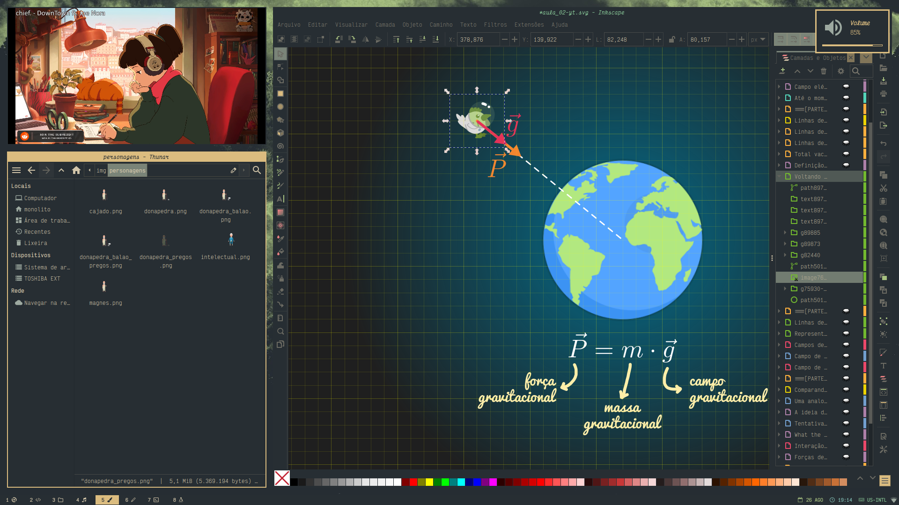

# dotfiles

## intro




- **system**: [void linux](https://voidlinux.org) with [xfce](https://docs.xfce.org/start)
- **wm**: [i3wm](https://i3wm.org)
- **gtk themes**: mine, [numix oomox based](https://github.com/themix-project/themix-gui); palettes:
    - [everforest](https://github.com/sainnhe/everforest), light and dark variants
    - [gruvbox](https://github.com/morhetz/gruvbox), light and dark variants
- **terminal**: xfce4-terminal
- **fonts**: _Iosevka_ and _VictorMono_ [Nerd Fonts](https://www.nerdfonts.com/font-downloads)
- **launchers**: [rofi](https://github.com/davatorium/rofi) and [dmenu](https://tools.suckless.org/dmenu/)
- **file managers**: [ranger](https://github.com/ranger/ranger) and [thunar](https://docs.xfce.org/xfce/thunar/start)
- **editor**: [vim](https://www.vim.org/) (RIP Bram)
- other stuff:
    - **browser**: [qutebrowser](https://www.qutebrowser.org)
    - **pdf reader**: [zathura](https://pwmt.org/projects/zathura/)
    - **image viewer**: [feh](https://github.com/derf/feh)
    - **music player**: [ncmpcpp](https://github.com/ncmpcpp/ncmpcpp) with [mpd](https://github.com/MusicPlayerDaemon/MPD) and [mpdscribble](https://github.com/MusicPlayerDaemon/mpdscribble) —  [last.fm](https://www.last.fm/user/pedrobitten) for the win!
    - **notifications**: [dunst](https://dunst-project.org/)
    - _more_ **terminals**: [alacritty](https://alacritty.org/) and [kitty](https://sw.kovidgoyal.net/kitty/)

## install

**Attention!** If you, dear reader, are not a _me from the future_, I recommend
that you **don't** simply clone and run scripts from this repository. He was
developed to improve _my process_ on getting this enviroment on a fresh
install.

The script [install.sh](install.sh) aims to:

1. Install packages, via `xbps-install`.
1. Clone the repository.
1. Copy files and create symlinks.
1. Get other resources, like fonts, cursors, icons and themes.

You can download it, set permission for execution e execute it. This can be
done with `wget`:

```
$ wget https://raw.githubusercontent.com/pbittencourt/dotfiles/master/install.sh -O install.sh
$ chmod +x install.sh
$ ./install.sh
```

**Again**, I strongly recommend that you **do not execute** it unless you now
exactly what you're doing. This script will create copies and links for
important files on your system and, probably, break several programs on your
machine. Check its [contents](install.sh) before attempting to execute.

## themes

### everforest dark


Wallpaper: modification of [carmine de fazio's photography](https://unsplash.com/photos/3ytjETpQMNY)
—  inspired by [elenapan's mod](https://i.imgur.com/NuFVbLW.jpg)

### everforest light


Wallpaper: modification of [geronimo giqueaux's photography](https://unsplash.com/photos/w2WUqRvTmtg)

### gruvbox dark


Wallpaper: modification of [jeremy geddes's art](https://www.jeremygeddesart.com/painting_group/transient) —  ASCENT, 2014

### gruvbox light


Wallpaper: modification of [jeremy geddes's art](https://www.jeremygeddesart.com/painting_group/transient) —  ROTATOR, 2019

## features

**qutebrowser** and **duck duck go** matching palettes


**theme selector**


**wallpaper selector**


**i3 keybindings** —  I always forgot my combos ...


**bash history**


## author

Pedro P. Bittencourt
