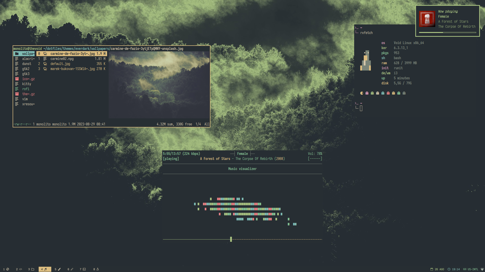
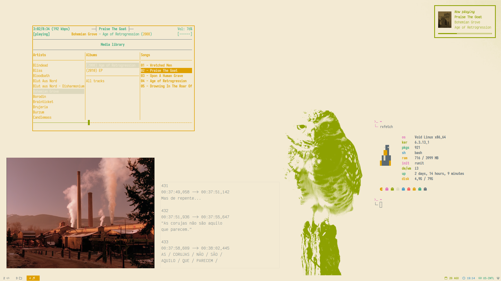

# dotfiles

## screenshots

<p align="center">
  
  
  
  
</p>

## specifications

- **system**: [void linux](https://voidlinux.org) with [xfce](https://docs.xfce.org/start)
- **wm**: [i3wm](https://i3wm.org)
- **gtk themes**: mine, [numix oomox based](https://github.com/themix-project/themix-gui); palettes:
    - [everforest](https://github.com/sainnhe/everforest), light and dark variants
    - [gruvbox](https://github.com/morhetz/gruvbox), light and dark variants
- **terminal**: xfce4-terminal
- **fonts**: _JetBrainsMono_ and _VictorMono_ [Nerd Fonts](https://www.nerdfonts.com/font-downloads)
- **launchers**: [rofi](https://github.com/davatorium/rofi) and [dmenu](https://tools.suckless.org/dmenu/)
- **file managers**: [ranger](https://github.com/ranger/ranger) and [thunar](https://docs.xfce.org/xfce/thunar/start)
- **editor**: [vim](https://www.vim.org/) (RIP Bram)
- other stuff:
    - **browser**: [qutebrowser](https://www.qutebrowser.org)
    - **pdf reader**: [zathura](https://pwmt.org/projects/zathura/)
    - **image viewer**: [feh](https://github.com/derf/feh)
    - **music player**: [ncmpcpp](https://github.com/ncmpcpp/ncmpcpp) with [mpd](https://github.com/MusicPlayerDaemon/MPD) and [mpdscribble](https://github.com/MusicPlayerDaemon/mpdscribble) —  [last.fm](https://www.last.fm/user/pedrobitten) for the win!
    - **notifications**: [dunst](https://dunst-project.org/)
    - _more_ **terminals**: [alacritty](https://alacritty.org/) and [kitty](https://sw.kovidgoyal.net/kitty/)

## install

> [!CAUTION]
> If you, dear reader, are not _me from the future_, I strongly advise against
> simply cloning and running the scripts from this repository. These scripts
> were specifically developed to streamline my setup process for configuring
> this environment on a fresh install.

The script [install.sh](install.sh) aims to:

1. Install packages, via `xbps-install`.
1. Clone the repository.
1. Copy files and create symlinks.
1. Get other resources, like fonts, cursors, icons and themes.

You can download it, set permission for execution e execute it. This can be
done with `wget`:

```bash
$ wget https://raw.githubusercontent.com/pbittencourt/dotfiles/master/install.sh -O install.sh
$ chmod +x install.sh
$ ./install.sh
```

Once again, I **strongly recommend** not running this script unless you fully
understand its functionality. It will create copies and links for critical
files on your system and may disrupt several programs on your machine. Be sure
to [review its contents](install.sh) carefully before attempting to execute it.

## themes

### everforest dark



Wallpaper: modification of [carmine de fazio's photography](https://unsplash.com/photos/3ytjETpQMNY)
—  inspired by [elenapan's mod](https://i.imgur.com/NuFVbLW.jpg)

### everforest light



Wallpaper: modification of [geronimo giqueaux's photography](https://unsplash.com/photos/w2WUqRvTmtg)

### gruvbox dark


Wallpaper: modification of [jeremy geddes's art](https://www.jeremygeddesart.com/painting_group/transient) —  ASCENT, 2014

### gruvbox light


Wallpaper: modification of [jeremy geddes's art](https://www.jeremygeddesart.com/painting_group/transient) —  ROTATOR, 2019

## features

**qutebrowser** and **duck duck go** matching palettes


**theme selector**


**wallpaper selector**


**i3 keybindings** —  I always forgot my combos ...


**shell history**


## author

Pedro P. Bittencourt
